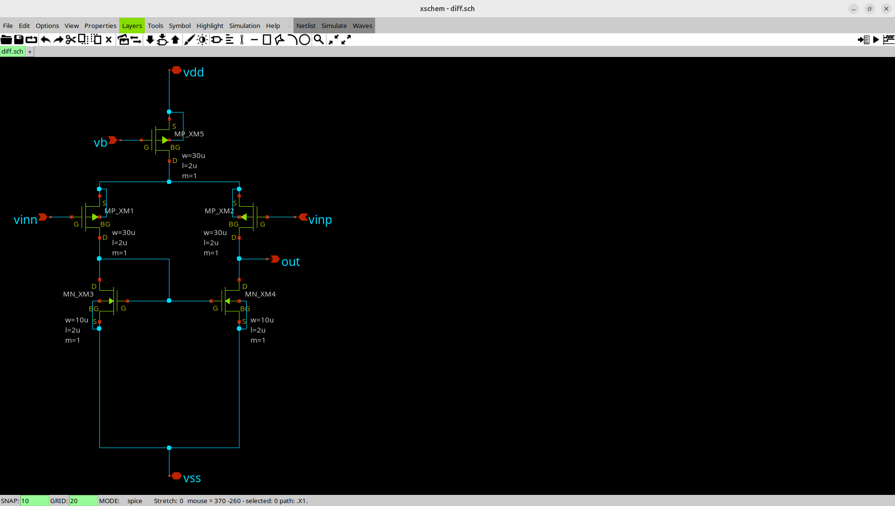
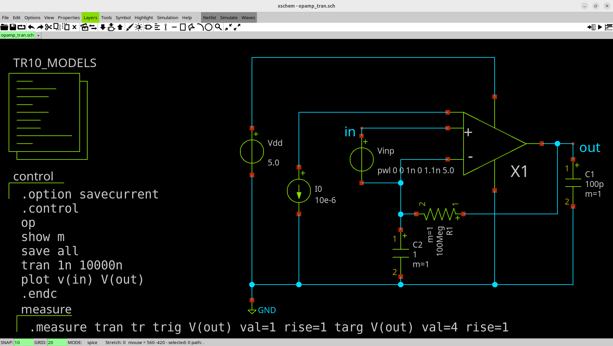

# 概要
OPAMPを1um CMOS processで作ります。目的はアナログICの設計方法を理解するためなので市販品の安価な汎用OPAMPに負ける性能でよしとし、目的に必要
な最低限の性能を目指します。

# 作成した回路図
## OPAMP全体
[opamp.sch](opamp.sch)

## 差動増幅回路

## ソース接地増幅回路


# 作成した回路レイアウト
[opamp.gds](opamp.gds)


# テストベンチ
## トランジェント解析
### 回路図
[opamp_tran.sch](opamp_tran.sch)

### 解析結果
ステップ入力を与えて、0V近辺から5V近辺までスイングできることを確認しました。


## AC解析
### 回路図
[opamp_ac.sch](opamp_ac.sch)

### 解析結果
ゲイン特性

位相特性


# 制約条件
今回使用するFabの製造プロセスは1um CMOSなので、CMOSトランジスタのドレインからソースまでのチャネル長さLの最小値は1umです。１つのダイの上に、乗合で回路を乗せるので、面積制約があります。使用可能なピン本数も制約があります。
また、製造プロセスの都合上、高精度な基準電流源を構成出来ないので、基準電流源は外部から10uAを供給する仕様にします。
| 項目  | 内容 |
| ------------- | ------------- |
| 使用可能回路面積  |   600um x 200umまで |
| 使用可能ピン本数  | 5ピンまで（VSSは除く） |
| 基準電流源  | 外付け10uA |


# 使用したソフト環境
| 項目  | 内容 |
| ------------- | ------------- |
| 回路図設計  |   Xschem |
| 回路シミュレーション | ngspice |
| レイアウト設計| klayout |
| グラフ作成 | Gnuplot |
| OS | Ubuntu |

# Fabに依存するデータ
| 項目  | 内容 |
| ------------- | ------------- |
| ngspice用のCMOSの特性データ | Fab提供のPDK BSIM3 (level49)|
| klayoutのPCell | Fab提供のPDK|

# 設計目標仕様
マイクロフォンから入力して、イヤホンをならすことができる最低限のOPAMPにしたいと思います。
電源電圧は、一般的な5Vとします。入力電圧はマイクロフォンなので2mV程度を想定します。最大出力はイヤホンから音を
聞きたいので5mWとします。最大出力電流は、出力1Vのとき、5mA最大とします。
入力2mVp-pから出力3Vp-pに増幅したいため、クローズドループゲインは1500倍つまり63.52dB必要です。周波数は人間の>可聴周波数20Khzの2倍の40khzあればよいです。オープンループゲインはクローズドループゲインの10倍あれば十分なので
84dBとします。
| 項目  | 内容 |
| ------------- | ------------- |
| 電源電圧 | 5V |
| 入力振幅電圧 | 2mVp-p |
| 最大周波数 | 40Khz |
| 最大出力 | 5mW|
| 最大出力振幅電圧 | 3Vp-p|
| 最大出力電流 | 5mA@1V|
| 出力電圧範囲 | 1-4V |
| クローズドループゲイン | 64dB@40khz |
| オープンループゲイン | 84dB@40khz |

# OPAMPのスルー・レート
波形が歪まないスルーレートの条件は次のとおりです。\
$$SR >= 2pi * f * Vp\
SR:スルーレート\
pi:円周率\
f:周波数\
Vp:電圧振幅\
$$
したがって、\
$$SR => 2 * 3.14 * 40000 * 3 = 753600V/s$$\
$$SR => 0.7536V/us$$\
以上より、今回のOPAMPのスルー・レートは0.7536V/us以上とします。


# 使用するトランジスタのサイズ検討
OPAMP設計では流す電流値に精度がほしいので、チャネル長変調によるドレイン電流の変化がどれくらいか検討します。チャネル長さLの違いがカレントミ
ラー回路の出力のコピー精度にどの程度影響するかを確認します。
比較の際に増幅率を同じにするため、チャネル幅W/チャネル長L = 10になるように、チャネル幅Wの長さを変更します。
確認するためのシミュレーション回路図は下記のとおりです。
[short_channel.sch](short_channel.sch)


| No | チャネル長L  | チャネル幅W |　出力電流(5V時)|誤差|
| -- | ------------ | ----------- | -------------- | -- |
| 1 | 1um | 10um | 11.749uA | 16.08% |
| 2 | 2um | 20um | 10.856uA | 8.209% |
| 3 | 3um | 30um | 10.615uA | 5.967% |
| 4 | 4um | 40um | 10.485uA | 4.735% |

誤差を10%以内に抑えたいので、チャネル長Lは2umとします。


# 付録
## Xschem + Gnuplotの使い方
Xschemの"Netlist"ボタンを押して、"Simulate"ボタンを押すと、ngspiceでシミュレーション実行されます。
シミュレーション実行した結果のファイルは次のパスに保存されます。
``` 
~/.xschem/simulations/
```
また、xschemの.control中で次のコマンドを使用するとGnuplot用のグラフ表示ファイルを生成可能です。

```
gnuplot gp i(Vi1) i(Vi2) i(Vi3) i(Vi4)
```

上記のコマンドを実行すると下記にGnuplot用のグラフ表示ファイルが生成されます。
\*.pltがグラフ生成スクリプトです。\*.dataが実際のグラフデータです。

```
~/.xschem/simulations/gp.plt
~/.xschem/simulations/gp.data
```
Gnuplotを使って、グラフを表示するには次のコマンドを使います。

```
gnuplot -persist "gp.plt"
```

Gnuplotでは起動時に次のパスのファイルのスクリプトが自動実行されます。これを利用して、標準のグラフの線の色や太さをカスタマイズ可能です。

```
~/.gnuplot

```

カスタマイズした.gnuplotの例を次に置いておきます。グラフの線の色や太さを見やすく変更しています。
[.gnuplot](.gnuplot)


Gnuplotでの表示用のグラフデータを以下においておきます。
[01_short_channel.plt](01_short_channel.plt)
[01_short_channel.data](01_short_channel.data)

これらはGnuplotを使って以下のコマンドで表示可能です。

```
gnuplot -persist "01_short_channel.plt"
